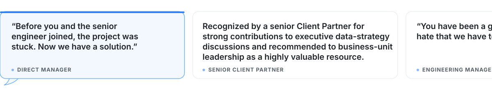

# Anand Krishnamoorthy

### Senior AI Engineer · Agentic Systems · Enterprise AI

I design and build production-minded AI systems, agentic workflows, and enterprise AI applications that solve complex operational problems.

I focus on reliable agent behavior, grounded reasoning, governed execution, and integration with real enterprise workflows.

- **Build:** Agentic workflows, multi-agent systems, RAG, and intelligent automation
- **Evaluate:** Golden datasets, LLM-as-a-judge, guardrails, and agent reliability
- **Integrate:** AI with enterprise data, APIs, tools, and real-world workflows

## 📈 Selected Impact

- **30% → 100%** agent evaluation accuracy
- **Top 10 / 6,000+** global datathon participants — solo-built solution
- Built & deployed end-to-end a Qwen-powered multi-agent AI system on Alibaba Cloud

## What Leaders & Teammates Have Said

## 🚀 Featured Systems & Projects

| Project | Architecture & execution | Stack |
| :--- | :--- | :--- |
| **[Corporate Intelligence Harness (Qwen)](https://github.com/AnandKrishnamoorthy1/corporate-intelligence-harness-qwen)** | Multi-agent corporate intelligence system that decomposes research questions, coordinates specialized agents, grounds analysis in live tools, and governs consequential actions | `Qwen` `LangGraph` `FastAPI` `Tool Calling` `Multi-Agent` |
| **[DataHub Aegis](https://github.com/AnandKrishnamoorthy1/DataHub-Aegis)** | Metadata-grounded SQL agent that detects schema drift, traces affected queries, generates repairs, validates them against PostgreSQL, and records the verified recovery | `LangGraph` `DataHub` `MCP` `PostgreSQL` `FastAPI` |
| **[Ticket Automator Solution (TAS) — 🏆 Global Champion, 6,000+ participants](https://github.com/AnandKrishnamoorthy1/Ticket-Automator-Solution)** | NLP automation system for ticket classification, prioritization, routing, key-phrase extraction, and resolution prediction | `Python` `NLP` `Machine Learning` |

### 🤖 AI & Agentic Systems

### 🔌 AI Applications & Integration

### ☁️ Cloud & Data

### 💻 Languages

## 🔭 Current Focus

- Building robust evaluation and reliability frameworks for agentic systems.
- Designing enterprise AI agents grounded in real data, tools, and business context.
- Developing governed workflows for reasoning, verification, and autonomous action.

## 📬 Connect & Read

I write about agentic AI, enterprise AI systems, evaluation, and the engineering decisions behind applied AI products.
